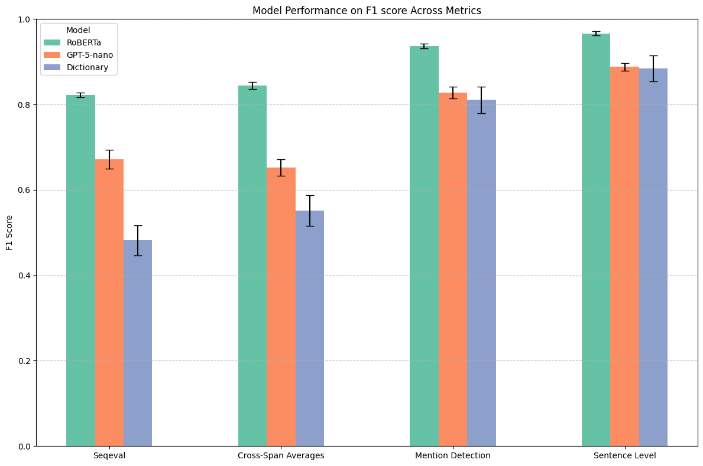
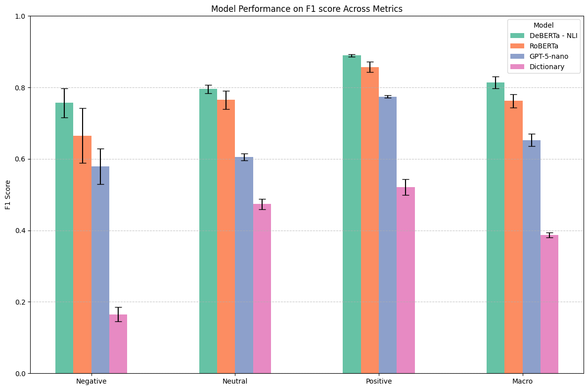

# Detecting Social Group Appeals Using LLMs
In this project, I develop an automated LLM-based classification pipeline for detecting social group appeals in parliamentary speeches. Social group appeals are defined as explicit references to social groups in which political actors position themselves in a supportive or critical manner. \
The pipeline consists of two main tasks. The detection of social group mentions using sequence labeling, and the classification of positional tone towards each group via stance classification. For both tasks, I evaluate encoder-only BERT models and generative GPT-based models, tuning hyperparameters and comparing performance using 5-fold cross-validation. \
The best-performing models are applied to a corpus of British parliamentary speeches from 2010 to 2019 at the sentence level. To further analyze detected group mentions, I implement an inductive clustering approach. This involves training a BERT model with contrastive learning to obtain semantically meaningful representations, which are then used to cluster group mentions into qualitative categories.

## Classification and Clustering Results


<p float="left">
  
  
</p>

## Reproducibility

### Environment Setup
The project was developed and tested using Python 3.13.4.
To run any files in this repository, create a virtual environment and install all required packages:
```
conda create -n social-group-appeals python=3.13.4
conda activate social-group-appeals
pip install -r requirements.txt
```

### Applying the Models
Quick demonstrations showing how the final classification models are applied can be found in the [Demo Notebooks](08_demo_notebooks/) folder. Note, that models are too large to be stored in this repo, but can be accessed through my [HuggingFace account](https://huggingface.co/maxwlnd).

## Folder Structure

### 01_data
Contains all data sources used to train the classifiers and needed for the empirical analysis.
* [classification](01_data/classification/) Manual annotations for training the classification models, dictionary to prefilter for group mentions and training/validation splits.
* [empirical_analysis](01_data/empirical_analysis/) Data sources needed for running the empirical analysis (election results, MP information and survey data).

### 02_preprocessing
Contains all Python scripts for preprocessing the speech data, creating the datasets for the empirical analysis and applying the train/validation split. Includes also the notebook in which data augmentations are created.

### 03_eda
Contains notebooks in which speech data is exploratively analyzed.

### 04_classification_models
Encompasses the creation of classification models for social group detection and stance classification with a variety of both encoder and generative LLMs.
* [evaluation_augmentations_oversampling](04_classification_models/evaluation_augmentations_oversampling/) Empirical evaluation of model performance with increasing dataset size as well as evaluation of using augmented data to oversample minority classes.
* [final_model_application](04_classification_models/final_model_application/) Applying the best performing classification models to the entire dataset.
* [group_mention_detection](04_classification_models/group_mention_detection/) Development of various BERT, GPT and dictionary models for the automatic detection of social group mentions. Evaluation via 5-fold cross-validation can be found in [cross_val_results](04_classification_models/group_mention_detection/cross_val_results/)
* [stance_classification](04_classification_models/stance_classification/) Development of various BERT, GPT and dictionary models for stance classification towards mentioned social groups. Evaluation via 5-fold cross-validation can be found in [cross_val_results](04_classification_models/stance_classification/cross_val_results/)

### 05_clustering
Contains the code to train a BERT model via contrastive learning for refining the embedding space in order to achieve better clustering results. Scripts to find the otpimal value of k for applying k-means clustering. Application of clustering to all detected social group appeals within the speeches dataset.

### 06_analysis
Contains the empirical analyis of the effects of speaker characteristics and constituency composition on legislators' usage of age appeals. Furthermore, analysis of the effect of age appeals rhetoric on voters' election decisions.

### 07_reports_presentations
The final report of my Thesis as well as its proposal and colloquium presentation.

### 08_demo_notebooks
Quick demonstrations showing how the final classification models are applied.


